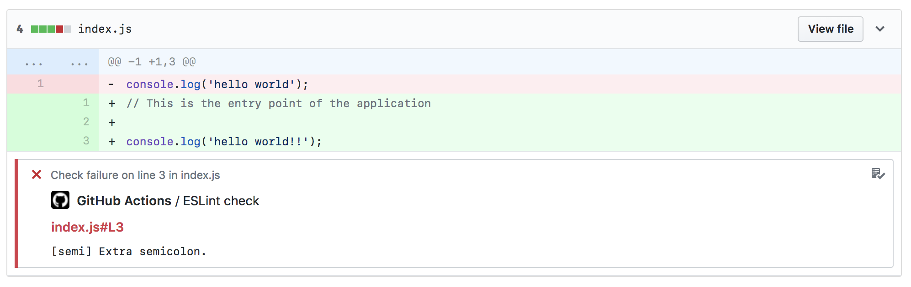

# ESLint Action

This is a GitHub Action that runs ESLint for `.js`, `.jsx`, and `.tsx` files using your `.eslintrc` rules. It's free to run and it'll annotate the diffs of your pull requests with lint errors and warnings.



Neat! Bet your CI doesn't do that.

## Usage

`.github/lint.yml`:

```yml
name: Lint

on: pull_request

jobs:
  eslint:
    runs-on: ubuntu-latest
    steps:
      - uses: actions/checkout@v1
      - uses: hallee/eslint-action@master
        with:
          repo-token: ${{secrets.GITHUB_TOKEN}}
          source-root: optional-sub-dir
```
